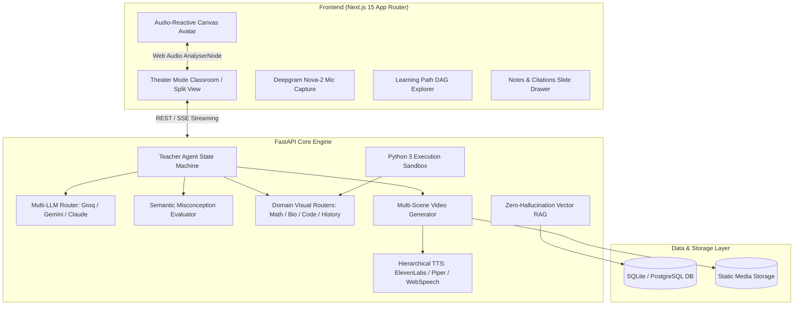
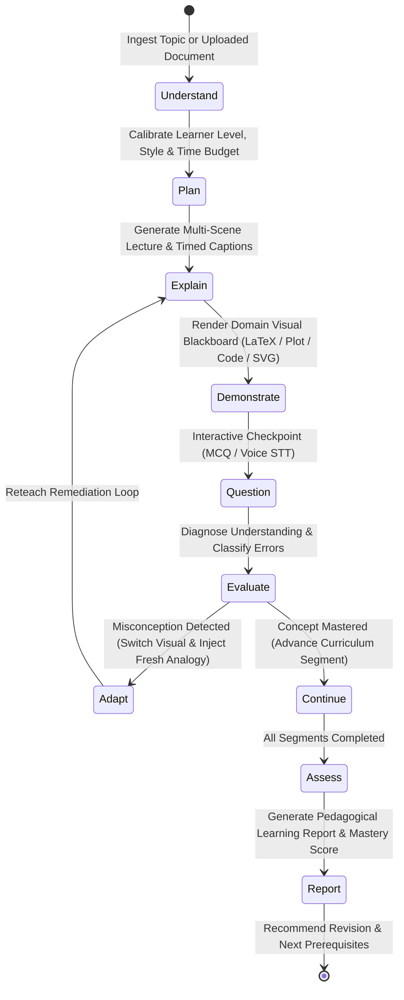

# Sahayak AI Teacher 🎓
### AI Innovation Hackathon 2026 · Round 2 Technical Assessment Submission
**Track**: *AI Teacher: Build a Human-Like AI Educator That Teaches Through Video*

> **"A True Adaptive AI Teacher, Not Just Another Chatbot."**

[](https://www.python.org/downloads/)
[](https://fastapi.tiangolo.com/)
[](https://nextjs.org/)
[](https://react.dev/)
[](https://tailwindcss.com/)
[](https://github.com/rhasspy/piper)
[](https://opensource.org/licenses/MIT)

---

## 🧭 1. Problem Statement

Traditional digital learning platforms generally deliver static pre-recorded lectures or text-based chat windows. However, real pedagogy does not work through walls of dumped text:
* A real human educator diagnoses prior knowledge and calibrates depth.
* Plans a structured cognitive progression (curriculum).
* Explains orally while dynamically illustrating on a blackboard.
* Periodically pauses for checkpoint concept checks.
* Catches misconceptions, diagnoses root cause errors, and reteaches adaptively using fresh analogies.
* Verifies mastery with assessments and diagnostics.

**Sahayak AI Teacher** is an autonomous pedagogical educator that replaces conversational chatbots with an end-to-end interactive, animated teaching video and adaptive state machine experience.

---

## 💡 2. Solution Overview

Sahayak transforms any uploaded educational document (textbook PDF, DOCX, PPTX, lecture notes) or user-specified topic into an immersive, personalized, animated classroom session:

```
[Document / Topic] ──▶ [RAG Grounding & Plan] ──▶ [Multi-Scene Video & Avatar] ──▶ [Interactive Q&A] ──▶ [Adaptive Reteaching] ──▶ [Mastery Report]
```

### Key Highlights:
1. **Multi-Scene Animated Teaching Video**: Local Ken Burns (`zoompan`) motion, progressive reveal slides, synced captions, and burned-in subtitles.
2. **Audio-Reactive Real-Time Avatar**: Browser-side HTML5 Canvas presenter whose mouth articulates in real time synced to speech amplitude via Web Audio `AnalyserNode`.
3. **Hierarchical Speech Engine**: ElevenLabs Neural Voice $\rightarrow$ Local Offline Piper Neural TTS $\rightarrow$ Browser Web Speech fallback.
4. **Semantic Misconception Diagnosis**: Evaluator classifies root causes and triggers dynamic remediation loops with distinct analogies and alternate visual routers.
5. **Subject-Aware Visual Blackboards**: LaTeX formulas, coordinate Cartesian plots, Python 3 isolated sandbox execution, SVG diagrams, and chronological roadmaps.
6. **7-Language Multilingual Support**: In-flight switching across English, Hindi, Hinglish, Tamil, Telugu, Bengali, and Spanish.
7. **Strict RAG Grounding**: 768-dim embeddings with verbatim chapter, section, and page citations.

---

## 🌟 3. Key Features

| Feature | Capability | Implementation |
|---|---|---|
| **Multi-Scene Video** | 16:9 MP4 explainer video with progressive reveals & Ken Burns effect | FFmpeg `zoompan` + `xfade` + Pillow/Matplotlib |
| **Talking AI Presenter** | Real-time mouth articulation & blinking synced to audio waveforms | Web Audio API (`AnalyserNode`) + HTML5 Canvas |
| **Offline Voice Narration** | Free local neural voice without external API costs or quotas | `piper-tts` (ONNX `en_US-lessac-medium`) |
| **Misconception Detection** | Pinpoints conceptual vs. arithmetic errors; prevents duplicate analogies | `EvaluatorService` + analogies memory bank |
| **Adaptive Blackboard** | Switches visual type (diagram $\rightarrow$ graph $\rightarrow$ sandbox) on reteach | Dynamic `VisualRouter` |
| **Code Execution** | Isolated Python 3 execution sandbox for computer science concepts | Subprocess runner (`/api/sandbox/run`) |
| **Voice Q&A** | Real-time speech-to-text for oral student checkpoint responses | Deepgram Nova-2 |
| **RAG Citations** | Clickable Coursera-style citation chips with confidence % and page tags | Gemini embeddings / deterministic cosine RAG |
| **Learning Path DAG** | Multi-session prerequisite graph visualization | Interactive React DAG with node status |

---

## 🏛️ 4. System Architecture



---

## 🧠 5. Teacher Agent Cognitive State Machine

The pedagogical lifecycle implements a formal Finite State Machine (FSM):



---

## 📚 6. RAG & Grounded Knowledge Pipeline

1. **Multi-Format Document Ingestion**:
   * PDF via `pypdf`
   * DOCX via `python-docx`
   * PPTX via `python-pptx`
   * TXT / Markdown
2. **Semantic Chunking**: 250–300 words with 40-word semantic overlap; preserves chapter headings, page numbers, and slide metadata.
3. **Vector Embeddings**: 768-dimensional embeddings (Gemini `text-embedding-004` with deterministic fallback).
4. **Citation Verification**: Every retrieved chunk is surfaced in the classroom UI as a clickable `CitationChip` displaying chapter, page, snippet, and confidence match.

---

## 🎯 7. Personalization Approach

| Dimension | Options Supported | Effect on Lesson Architecture |
|---|---|---|
| **Cognitive Level** | Beginner, Intermediate, Advanced | Controls vocabulary depth, mathematical rigor, and step derivations. |
| **Time Budget** | 5 Min, 20 Min, 60 Min, 7-Day Path | Adjusts segment count (2 segments $\rightarrow$ 4 segments $\rightarrow$ 6 segments $\rightarrow$ Multi-Session DAG). |
| **Pedagogical Style** | Visual, Analogies, Socratic, Code | Tailors dominant visual router and script explanation strategies. |
| **Language** | `en`, `hi`, `hinglish`, `ta`, `te`, `bn`, `es` | Re-synthesizes speech, on-screen text, blackboard labels, and quizzes. |

---

## 🎬 8. AI Video & Avatar Generation Pipeline

```
[Lesson Plan Script + Captions]
           │
           ▼
[Pillow + Matplotlib: Progressive Reveal Scene Slides (PNG)]
           │
           ▼
[FFmpeg Ken Burns Animation: Alternating zoompan Filters (25 FPS)]
           │
           ▼
[Hierarchical TTS Audio (ElevenLabs / Piper .wav)] + [SRT Subtitles Burn-in]
           │
           ▼
[Final Multi-Scene H.264 MP4 Explainer Video]
```

### Browser-Side Audio-Reactive Presenter & AI Teacher Studio:
* **Photorealistic AI Teacher Studio**: Interactive studio presentation environment with multi-tier ambient backdrops, neon status indicators, and pulsating audio-responsive glow rings.
* **Real-Time Voice Equalizer**: Dynamic multi-band frequency spectrum visualizer reacting directly to speech playback via the Web Audio API `AnalyserNode`.
* **Adaptive Display Toggle**: Seamlessly switch between the **AI Teacher Studio** and generated **Lecture Explainer Video** within both Theater and Split views without interrupting voice or lesson progress.
* **Canvas Fallback Articulation**: Real-time mouth articulation, eye blinking, and speech amplitude reactivity for lightweight low-bandwidth devices.

---

## 🌐 9. Multilingual Support

Sahayak supports **7 languages** with in-flight switching mid-lesson:
* 🇬🇧 **English** (`en`)
* 🇮🇳 **Hindi** (`hi` - हिंदी)
* 🇮🇳 **Hinglish** (`hinglish` - Conversational)
* 🇮🇳 **Tamil** (`ta` - தமிழ்)
* 🇮🇳 **Telugu** (`te` - తెలుగు)
* 🇮🇳 **Bengali** (`bn` - বাংলা)
* 🇪🇸 **Spanish** (`es` - Español)

Students can switch languages via the UI toggle or via natural language commands (e.g., *"Ab Hindi me samjhao"*).

---

---

## 📊 10. Assessment & Misconception Methodology

Sahayak evaluates student comprehension systematically across the teaching lifecycle:
1. **In-Lesson Checkpoint Evaluation**:
   * Evaluator classifies responses using Socratic principles: `mastery`, `partial`, `misconception`, `unclear`.
   * When a misconception is detected, the teacher does not simply say "incorrect"—it identifies the cognitive error, introduces a fresh analogy, alters the visual demonstration, and re-tests.
2. **Post-Lesson Comprehensive Quiz**:
   * Generates a 5-question adaptive assessment (MCQs, conceptual questions, code/problem-solving).
3. **Pedagogical Diagnostic Learning Report**:
   * Yields a detailed report containing:
     * Overall Mastery Score percentage
     * Concepts Understood & Strong Areas
     * Detected Weak Areas & Root Misconceptions
     * Targeted Revision Recommendations (actionable practice problems)
     * Recommended Next Learning Path Node

---

## 🚀 11. Quick Start & Setup Instructions (Local in 2 Minutes)

### Prerequisites
* **Python 3.10+**
* **Node.js 18+** and `npm`
* **FFmpeg** (ensure `ffmpeg` is available on system PATH)

### Step 1: Clone Repository
```bash
git clone https://github.com/Akshat-coder-101/AI-INNOVATION-.git
cd AI-INNOVATION-
```

### Step 2: Configure Environment
Copy the `.env.example` templates to `.env` (root or `backend/.env`) and `frontend/.env.local`:
```bash
# Root & Backend:
cp .env.example .env
cp backend/.env.example backend/.env

# Frontend:
cp frontend/.env.example frontend/.env.local
```

### Step 3: Start Backend (FastAPI)
```bash
cd backend
python -m venv .venv
# Windows:
.venv\Scripts\activate
# Linux/macOS:
source .venv/bin/activate

pip install -r requirements.txt
python -m uvicorn main:app --host 0.0.0.0 --port 8000 --reload
```
* API Documentation (Swagger): [http://localhost:8000/docs](http://localhost:8000/docs)
* Health Endpoint: [http://localhost:8000/api/health](http://localhost:8000/api/health)

### Step 4: Start Frontend (Next.js 15)
Open a second terminal:
```bash
cd frontend
npm install
npm run dev
```
* Web Application: [http://localhost:3000](http://localhost:3000)

---

## ☁️ 12. Deployment Instructions

### Frontend (Vercel)
1. Push your repository to GitHub.
2. Import the `frontend/` directory into [Vercel](https://vercel.com).
3. Set Environment Variables:
   * `NEXT_PUBLIC_API_BASE_URL`: Your deployed FastAPI backend URL (e.g., `https://sahayak-backend.onrender.com`).
4. Deploy with one click.

### Backend (Render / Railway / AWS / Docker)
Deploy using Docker or a standard Python Web Service:
```dockerfile
# Dockerfile
FROM python:3.11-slim
WORKDIR /app
RUN apt-get update && apt-get install -y ffmpeg curl && rm -rf /var/lib/apt/lists/*
COPY backend/requirements.txt .
RUN pip install --no-cache-dir -r requirements.txt
COPY backend/ .
EXPOSE 8000
CMD ["uvicorn", "main:app", "--host", "0.0.0.0", "--port", "8000"]
```
Set environment variables on your cloud dashboard as documented in `.env.example`.

---

## 🧪 13. Automated Test Suite & Verification

Execute the test suites verifying all 14 integration endpoints and type safety:
```bash
# Backend pytest suite (11 integration tests)
cd backend
python -m pytest tests/test_all_endpoints.py -v

# Live API and fallback diagnostics suite (14/14 endpoints operational)
python test_live_apis.py

# Frontend TypeScript type check
cd ../frontend
npx tsc --noEmit
```

---

## 🔌 14. APIs and Third-Party Services Disclosed

| Service / Tool | Purpose | Fallback / Alternative |
|---|---|---|
| **Google Gemini / Groq LLaMA 3.3** | LLM pedagogical reasoning, curriculum planning | Multi-provider fallback + deterministic templates |
| **Piper TTS (Local)** | Offline neural text-to-speech | Zero-cost local ONNX execution |
| **ElevenLabs API** | High-fidelity multilingual voice | Cascades to local Piper TTS / Web Speech |
| **Deepgram Nova-2** | Student microphone voice Q&A | Text keyboard submission |
| **FFmpeg** | Multi-scene Ken Burns video generation | Audio-reactive HTML5 Canvas avatar |
| **KaTeX & Recharts** | Mathematical LaTeX formulas & Cartesian plots | Interactive SVGs |

---

## ⚠️ 15. Known Limitations & Roadmap

1. **Third-Party API Quotas**: External services (ElevenLabs / HeyGen) may exhaust credits; Sahayak provides built-in zero-cost local Piper TTS and Web Audio Canvas Presenter fallbacks so evaluation never breaks.
2. **Sandbox Isolation**: The Python sandbox runs within a timeout-capped subprocess; production cloud deployment will utilize microVMs (gVisor / Firecracker).
3. **Complex Mathematical Proofs**: Extended multi-page proofs are partitioned across structured lesson segments.

---

## 👥 Hackathon Team

* **Project**: Sahayak AI Teacher 🎓
* **Hackathon**: AI Innovation Hackathon 2026
* **Repository**: [Akshat-coder-101/AI-INNOVATION-](https://github.com/Akshat-coder-101/AI-INNOVATION-.git)
