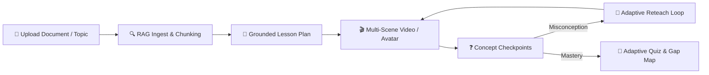
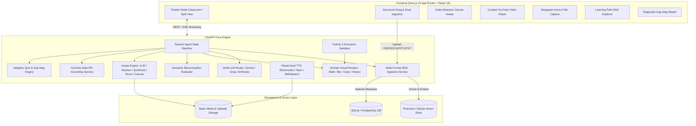
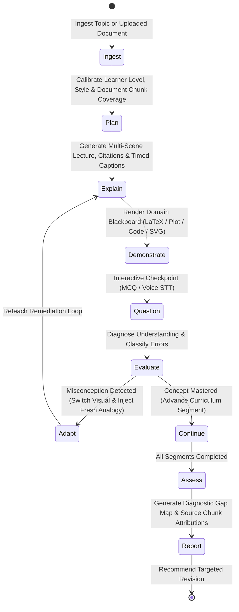

# Sahayak AI Teacher 🎓
### AI Innovation Hackathon 2026 · Technical Submission
**Track**: *AI Teacher: Build a Human-Like AI Educator That Teaches Through Video*

> **"A True Adaptive AI Teacher, Not Just Another Chatbot."**

[](https://www.python.org/downloads/)
[](https://fastapi.tiangolo.com/)
[](https://nextjs.org/)
[](https://react.dev/)
[](https://tailwindcss.com/)
[](https://developers.google.com/youtube/v3)
[](https://opensource.org/licenses/MIT)

---

## 🧭 1. Problem Statement

Traditional digital learning platforms typically deliver static pre-recorded videos or generic text chatbots. However, effective pedagogy requires active, adaptive teaching:
* **Diagnoses prior knowledge** and dynamically calibrates depth and pacing.
* **Plans a structured cognitive progression** grounded strictly in verified source materials.
* **Explains orally with synchronized visual illustrations** on an interactive blackboard.
* **Periodically pauses for pedagogical checkpoints** to test comprehension.
* **Detects misconceptions**, identifies cognitive root causes, and reteaches adaptively using fresh analogies and alternate visual modalities.
* **Validates mastery** with document-attributed quizzes and a diagnostic learning gap map.

**Sahayak AI Teacher** is an autonomous pedagogical educator that replaces conversational chatbots with an end-to-end interactive, animated teaching video and adaptive state machine experience.

---

## 💡 2. Solution Overview

Sahayak transforms any uploaded educational document (textbook PDF, DOCX, PPTX, lecture notes) or user-specified topic into an immersive, personalized, video-augmented classroom session:



### Core Innovations:
1. **Document-Grounded Lesson Pipeline**: Every lesson segment, video explanation, and quiz question is strictly attributed to source document chunks with verbatim citations, page numbers, and confidence ratings.
2. **Multi-Provider AI Avatar & Video Engine**: Supports **D-ID**, **HeyGen**, **Synthesia**, **Tavus**, **Colossyan**, **Replicate (LivePortrait)**, **Hugging Face SDXL**, and a built-in **Zero-Cost Audio-Reactive Canvas Avatar**.
3. **AI-Curated YouTube Educational Grounding**: Leverages YouTube Data API v3 with SQLite caching and LLM re-ranking to embed real, verified video deep-dives without hallucinations.
4. **Interactive Domain Blackboards**: Real-time LaTeX mathematics, coordinate Cartesian plots, isolated Python 3 execution sandboxes, and SVG diagrams.
5. **Hierarchical Multilingual Speech**: ElevenLabs Neural Voice $\rightarrow$ Local Offline Piper Neural TTS $\rightarrow$ Web Speech API fallback across **7 languages** (English, Hindi, Hinglish, Tamil, Telugu, Bengali, Spanish).
6. **Diagnostic Learning Gap Map**: Pinpoints conceptual strengths and weaknesses linked directly to document source chunks with actionable revision steps.

---

## 🌟 3. Feature Matrix

| Feature | Capability | Implementation |
|---|---|---|
| **Document RAG Ingest** | Validates & parses PDF, DOCX, PPTX, and TXT with chunk indexing | `pypdf`, `python-docx`, `python-pptx`, Gemini / Pinecone Vector RAG |
| **Grounded Lesson Planner** | Full-coverage curriculum planning strictly bounded to document chunks | `TeacherAgentStateMachine.plan_from_document` |
| **Talking AI Presenter** | Real-time mouth articulation & blinking synced to audio waveforms | Web Audio API (`AnalyserNode`) + HTML5 Canvas |
| **Paid Avatar & Video Suite** | Generates photorealistic teacher video lectures from scripts | D-ID, HeyGen, Synthesia, Tavus, Colossyan, Replicate |
| **Curated YouTube Grounding** | Retrieves verified, duration-matched concept explainer videos | YouTube Data API v3 + SQLite Cache |
| **Misconception Diagnosis** | Pinpoints conceptual errors and triggers dynamic remediation loops | `EvaluatorService` + analogy memory bank |
| **Adaptive Blackboard** | Switches visual type (diagram $\rightarrow$ graph $\rightarrow$ sandbox) on reteach | Dynamic `VisualRouter` (KaTeX, SVG, Recharts, Python) |
| **Python Code Sandbox** | Isolated Python 3 code execution for computer science concepts | Subprocess runner (`/api/sandbox/run`) |
| **Voice Q&A** | Real-time speech-to-text for oral student checkpoint responses | Deepgram Nova-2 |
| **Diagnostic Gap Map** | Visual mastery breakdown tagged with Bloom's taxonomy & source chunks | `AssessmentService.build_learning_report` |

---

## 🏛️ 4. System Architecture



---

## 🧠 5. Teacher Agent Cognitive State Machine

The pedagogical lifecycle implements a formal Finite State Machine (FSM):



---

## 📚 6. Document-Grounded RAG Pipeline

1. **Multi-Format Ingestion**: Parses `.pdf`, `.docx`, `.pptx`, and `.txt` files securely.
2. **Safe Storage & Chunking**: Stores files under unique UUID directories and splits content into 250–300 word chunks with 40-word semantic overlap.
3. **Vector Embeddings**: Generates 768-dimensional embeddings using Gemini `text-embedding-004` (with deterministic cosine similarity fallback).
4. **Full-Document Coverage Planning**: Partitions document chunks evenly across lesson segments to guarantee complete coverage without omission.
5. **Verbatim Grounding & Citations**: Every segment explanation re-retrieves its cited chunks and prompts the LLM:
   > *"Teach ONLY from the provided source material. Cite it. If the student asks about something not covered by these sources, say it is outside this document — do not invent it."*
6. **Citation Chips**: Clickable Coursera-style citation chips display document name, chunk ID, page number, and quote snippets directly in the classroom UI.

---

## 🎭 7. AI Avatar & Video Generation Suite

Sahayak supports an extensive suite of free and paid video/avatar generation engines:

| Provider | Setting | Best For |
| :--- | :--- | :--- |
| **Interactive Canvas Avatar** | `AVATAR_PROVIDER=free_avatar` | 100% free, zero API key required, reactive Web Audio mouth articulation & equalizer. |
| **D-ID API** | `AVATAR_PROVIDER=did` | Photo-to-talking-head video lectures from a single teacher portrait. |
| **HeyGen API** | `AVATAR_PROVIDER=heygen` | Ultra-realistic digital twins, studio presenters, and streaming WebRTC avatars. |
| **Synthesia API** | `AVATAR_PROVIDER=synthesia` | Enterprise classroom video lectures with 160+ multilingual instructors. |
| **Tavus API** | `AVATAR_PROVIDER=tavus` | Low-latency conversational replicas. |
| **Colossyan API** | `AVATAR_PROVIDER=colossyan` | Multi-actor educational video courseware. |
| **Replicate (LivePortrait)** | `AVATAR_PROVIDER=replicate` | High-fidelity open-source portrait animation. |
| **Hugging Face SDXL** | `AVATAR_PROVIDER=huggingface` | Generates custom AI professor portraits from text prompts. |

---

## 🌐 8. Multilingual Support

Sahayak supports **7 languages** with in-flight switching mid-lesson:
* 🇬🇧 **English** (`en`)
* 🇮🇳 **Hindi** (`hi` - हिंदी)
* 🇮🇳 **Hinglish** (`hinglish` - Conversational)
* 🇮🇳 **Tamil** (`ta` - தமிழ்)
* 🇮🇳 **Telugu** (`te` - తెలుగు)
* 🇮🇳 **Bengali** (`bn` - বাংলা)
* 🇪🇸 **Spanish** (`es` - Español)

Students can switch languages via the UI toggle or via natural language commands (e.g., *"Ab Hindi me samjhao"*).

---

## 📊 9. Assessment & Diagnostic Gap Map

1. **In-Lesson Checkpoint Evaluation**: Evaluator classifies responses as `mastery`, `partial`, `misconception`, or `unclear`. Misconceptions trigger targeted remediation loops.
2. **Document-Grounded Quiz**: Generates adaptive questions tagged with Bloom's taxonomy cognitive levels (`Recall`, `Understand`, `Apply`, `Analyze`) and mapped to specific document `chunk_id`s.
3. **Diagnostic Gap Map**: Visual breakdown of strong vs. weak concepts with:
   - Chunk ID and page citations for every question.
   - Root cause error classification (conceptual vs. arithmetic).
   - Targeted revision recommendations and practice problems.

---

## 🚀 10. Quick Start & Setup Instructions

### Prerequisites
* **Python 3.10+**
* **Node.js 18+** and `npm`
* **FFmpeg** (ensure `ffmpeg` is available on system PATH)

### Step 1: Clone Repository
```bash
git clone https://github.com/Akshat-coder-101/AI-INNOVATION-.git
cd AI-INNOVATION-
```

### Step 2: Configure Environment Variables
Copy `.env.example` templates to `.env` and `frontend/.env.local`:
```bash
# Root & Backend:
cp .env.example .env
cp backend/.env.example backend/.env

# Frontend:
cp frontend/.env.example frontend/.env.local
```

Fill in your API keys in `.env` (Gemini, Groq, YouTube, ElevenLabs, Deepgram, etc.).

### Step 3: Start Backend (FastAPI)
```bash
cd backend
python -m venv ../venv
source ../venv/bin/activate   # On Windows: ..\venv\Scripts\activate
pip install -r requirements.txt

python -m uvicorn main:app --host 0.0.0.0 --port 8000 --reload
```
* API Documentation (Swagger UI): [http://localhost:8000/docs](http://localhost:8000/docs)
* Health Check: [http://localhost:8000/health](http://localhost:8000/health)

### Step 4: Start Frontend (Next.js 15)
In a new terminal:
```bash
cd frontend
npm install
npm run dev
```
* Web Application: [http://localhost:3000](http://localhost:3000)
* Document Upload: [http://localhost:3000/upload](http://localhost:3000/upload)

---

## 🧪 11. Automated Test Suite

Run the comprehensive pytest suite verifying all endpoints, RAG ingestion, lesson planning, and gap map generation:
```bash
cd backend
source ../venv/bin/activate
pytest tests/ -v
```

---

## 🔌 12. Third-Party Services Disclosed

| Service / Tool | Purpose | Fallback / Alternative |
|---|---|---|
| **Google Gemini / Groq LLaMA 3.3** | LLM pedagogical reasoning, curriculum planning | Multi-provider fallback + deterministic templates |
| **YouTube Data API v3** | Curated video grounding & deep-dives | Direct search URL generation |
| **ElevenLabs API** | Multilingual neural text-to-speech | Local Piper ONNX / Browser Web Speech |
| **Deepgram Nova-2** | Student microphone voice Q&A | Text keyboard submission |
| **D-ID / HeyGen / Synthesia / Tavus** | Photorealistic AI teacher video generation | Interactive Canvas Avatar (Zero-cost) |
| **KaTeX & Recharts** | Mathematical LaTeX formulas & Cartesian plots | Interactive SVGs & Python Sandbox |

---

## 👥 Hackathon Team

* **Project**: Sahayak AI Teacher 🎓
* **Hackathon**: AI Innovation Hackathon 2026
* **Repository**: [Akshat-coder-101/AI-INNOVATION-](https://github.com/Akshat-coder-101/AI-INNOVATION-.git)
* **License**: MIT
