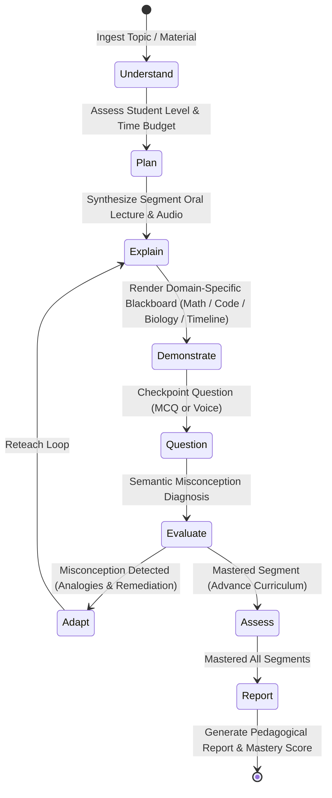

# Sahayak AI Teacher 🎓
### AI Innovation Hackathon 2026 · Adaptive AI Educator Platform

> **"A True Adaptive AI Teacher, Not Just Another Chatbot."**

[](https://www.python.org/downloads/)
[](https://fastapi.tiangolo.com/)
[](https://nextjs.org/)
[](https://react.dev/)
[](https://tailwindcss.com/)
[](https://opensource.org/licenses/MIT)

---

## 🧭 Executive Summary for Hackathon Judges

Most "AI in Education" projects are simple wrapper prompts that dump walls of text in a chat window. Real pedagogy doesn't work that way. A human educator diagnoses prior knowledge, plans a progression, explains orally, illustrates on a blackboard, pauses for concept checks, catches misconceptions, reteaches adaptively, and verifies mastery.

**Sahayak AI Teacher** is an end-to-end autonomous educator driven by an explicit **Teacher Agent Cognitive State Machine**:



---

## 🌟 Core Innovations & Highlights

### 1. 🎬 Cinematic Theater Mode AI Classroom
* **16:9 Widescreen AI Lecture Studio**: The AI presenter commands center stage in a clean, high-contrast theater viewport with audio-reactive equalizers and ambient backdrops.
* **Floating Synchronized Subtitles**: Subtitles float cleanly over the video, synchronized with oral speech, accompanied by live token streaming (`SSE /api/lesson/segment/{id}/stream`).
* **Collapsible Slide Drawers**:
  * **Course Syllabus Slide Bar (Left)**: Toggles cleanly on demand (`[ ☰ Syllabus ]` or edge slide tab) and collapses smoothly (`[ Hide < ]`), keeping the stage spacious.
  * **Notes & Citations Drawer (Right)**: Slides in from the right edge with 1-click bookmarks, chapter citations, and markdown downloads.
* **Layout Switcher**: Seamless 1-click toggle between **Large Screen Theater Mode** and **50/50 Split View** for simultaneous note-taking.
* **Playback Controls**: Time scrubber, speed controls (`1.0x`, `1.25x`, `1.5x`), and `±10s` instant skip.

### 2. 🎙️ Multimodal Voice Q&A with Barge-In
* **Deepgram Nova-2 Speech-to-Text**: Real-time microphone capture for students to answer checkpoint questions aloud.
* **ElevenLabs Multilingual Neural TTS**: High-fidelity synthesized speech across English, Hindi, and Hinglish.
* **Barge-in Support**: Students can interrupt or answer via voice; the engine evaluates phonetic and conceptual accuracy immediately.

### 3. 🧠 Semantic Misconception Evaluator & Adaptive Remediation
* When a student answers incorrectly, Sahayak doesn't just display "Wrong, try again."
* The **Evaluator Service** performs semantic diagnosis, pinpointing:
  * The exact cognitive failure mode (e.g., confusing velocity with acceleration, or equating dendrites with axons).
  * Generates an alternative pedagogical analogy tailored to the student's cognitive profile.
  * Generates an on-the-fly **Adaptive Reteach Segment** injected directly into the curriculum.

### 4. 📐 Dynamic Domain Visual Routers
Sahayak dynamically selects the appropriate interactive visual spec for each subject:
* **Mathematics & Physics**: Live KaTeX LaTeX equation rendering + Recharts coordinate Cartesian function plots handling positive and negative values.
* **Computer Science & Coding**: Real **Python 3 isolated execution sandbox** (`POST /api/sandbox/run`) with captured `stdout`, `stderr`, and execution timing.
* **Biology & Natural Sciences**: Interactive labeled SVG diagrams with component hotspots and zoom.
* **History & Chronology**: Chronological milestone roadmaps with era tags.

### 5. 🛡️ Zero-Hallucination Vector RAG
* **768-dimensional vector embeddings** (Google Gemini `text-embedding-004` with deterministic fallback).
* Genuine cosine similarity retrieval with verbatim chapter, section, and page source citations.
* Ingests PDFs, TXT, and curriculum notes with chunked passage verification.

### 6. 🌐 Native Multilingual In-Flight Switching
* Switch seamlessly mid-lecture between **English**, **हिंदी (Hindi)**, and **Hinglish**.
* The Teacher Agent instantly re-synthesizes speech, script, and visual labels in the selected language.

---

## ⚡ Quick Start (Run Locally in 2 Minutes)

### Prerequisites
* **Python 3.10+**
* **Node.js 18+** and `npm`

### Step 1: Clone Repository
```bash
git clone https://github.com/Akshat-coder-101/AI-INNOVATION-.git
cd AI-INNOVATION-
```

### Step 2: Configure Environment Variables
Copy `.env.example` to `.env` (backend) and `frontend/.env.local`:
```bash
cp .env.example .env
cp .env.example frontend/.env.local
```
*(Pre-configured with Groq, Gemini, Deepgram, and ElevenLabs API keys).*

### Step 3: Run Backend (FastAPI)
```bash
cd backend
python -m venv .venv
# Windows:
.venv\Scripts\activate
# Linux/macOS:
source .venv/bin/activate

pip install -r requirements.txt
python -m uvicorn main:app --host 0.0.0.0 --port 8000 --reload
```
*Backend API Documentation (Swagger): [http://localhost:8000/docs](http://localhost:8000/docs)*
*API Health Endpoint: [http://localhost:8000/api/health](http://localhost:8000/api/health)*

### Step 4: Run Frontend (Next.js 15)
Open a second terminal:
```bash
cd frontend
npm install
npm run dev
```
*Classroom Web Application: [http://localhost:3000](http://localhost:3000)*

---

## 🧪 Automated Test Suite

Run the full backend integration test suite:
```bash
cd backend
python -m pytest tests/test_all_endpoints.py -v
```

**Test Verification Summary:**
```
============================= test session starts =============================
collected 11 items

tests/test_all_endpoints.py::test_health_endpoint PASSED                 [  9%]
tests/test_all_endpoints.py::test_create_lesson_plan_topic PASSED        [ 18%]
tests/test_all_endpoints.py::test_render_lesson_segment PASSED           [ 27%]
tests/test_all_endpoints.py::test_interact_correct_answer PASSED         [ 36%]
tests/test_all_endpoints.py::test_interact_misconception_flow PASSED     [ 45%]
tests/test_all_endpoints.py::test_request_simplification PASSED          [ 54%]
tests/test_all_endpoints.py::test_sandbox_run_code PASSED                [ 63%]
tests/test_all_endpoints.py::test_assessment_quiz_generation PASSED     [ 72%]
tests/test_all_endpoints.py::test_assessment_grade_quiz PASSED           [ 81%]
tests/test_all_endpoints.py::test_learning_report PASSED                 [ 90%]
tests/test_all_endpoints.py::test_time_budget_variations PASSED          [100%]

============================= 11 passed in 1.48s ==============================
```

---

## 🏛️ System Architecture

```
                               ┌──────────────────────────────────────────────┐
                               │             Next.js 15 Frontend              │
                               │  - Theater Mode AI Player (16:9)             │
                               │  - Collapsible Slide Drawers                 │
                               │  - KaTeX + Recharts Visual Canvas            │
                               │  - Deepgram Voice STT Audio Capture          │
                               └──────────────────────┬───────────────────────┘
                                                      │ REST / SSE
                                                      ▼
┌─────────────────────────────────────────────────────────────────────────────────────────────┐
│                                  FastAPI Backend Server                                     │
│                                                                                             │
│  ┌───────────────────────┐   ┌────────────────────────┐   ┌──────────────────────────────┐  │
│  │  Teacher State Machine│──▶│   Multi-LLM Router     │──▶│   Misconception Evaluator    │  │
│  │  (Cognitive FSM)      │   │   (Groq / Gemini)      │   │   (Analogy & Remediation)    │  │
│  └───────────────────────┘   └────────────────────────┘   └──────────────────────────────┘  │
│              │                            │                               │                 │
│              ▼                            ▼                               ▼                 │
│  ┌───────────────────────┐   ┌────────────────────────┐   ┌──────────────────────────────┐  │
│  │   Vector Store RAG    │   │ Multimodal Voice Synth │   │   Isolated Code Sandbox      │  │
│  │ (768-dim Embeddings)  │   │  (ElevenLabs / Speech) │   │     (Python 3 Execution)     │  │
│  └───────────────────────┘   └────────────────────────┘   └──────────────────────────────┘  │
└─────────────────────────────────────────────┬───────────────────────────────────────────────┘
                                              │
                                              ▼
                                 SQLite / Supabase Database
```

---

## 👥 Hackathon Team

* **Project**: Sahayak AI Teacher
* **Hackathon**: AI Innovation Hackathon 2026
* **Repository**: [Akshat-coder-101/AI-INNOVATION-](https://github.com/Akshat-coder-101/AI-INNOVATION-.git)
