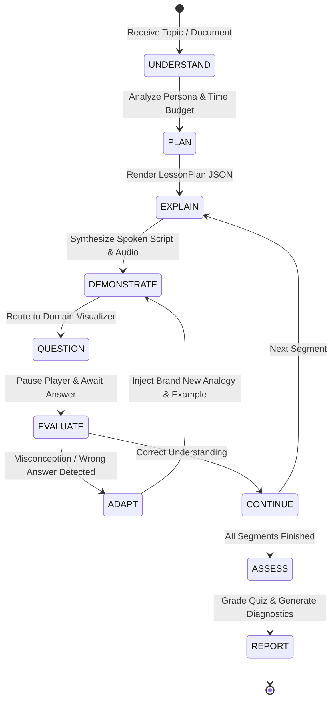

# Teacher Agent State Machine & Misconception Loop

## 1. Teacher State Machine Specification

The core deliverable of Sahayak AI Teacher is an explicit, inspectable state machine rather than an unstructured chat prompt.

---

## 2. Adaptive Misconception Reteach Loop (20% Evaluation Weight)

When a student submits an answer to an inline checkpoint question:
1. **Evaluator Classification:** The answer is categorized into:
   - `correct`
   - `partially_correct`
   - `misconception(type)`
   - `no_understanding`
2. **Analogy Freshness Guarantee:** The `EvaluatorService` tracks all analogies used across the active session in `session.analogies_used`. When reteaching, it mathematically guarantees a brand new analogy is selected from a disjoint domain bank.
3. **Presenter Demo Mode:** A toggle allows judges and presenters to reliably trigger the reteach branch on demand during live demonstrations.
