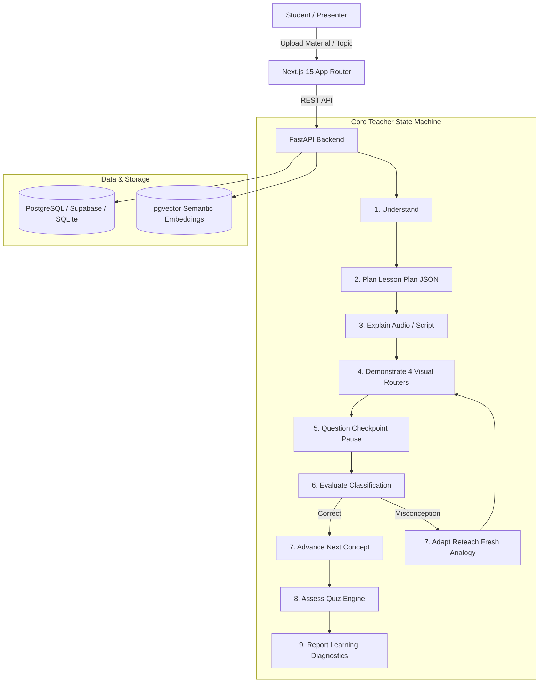

# Sahayak AI Teacher — System Architecture

## 1. High-Level Architecture Overview

Sahayak AI Teacher is built as a state-machine driven educational platform designed for the **AI Innovation Hackathon 2026**.

---

## 2. Component Breakdown

| Layer | Technology | Primary Role |
|---|---|---|
| **Frontend** | Next.js 15 (App Router), TypeScript, Tailwind CSS | Multi-page judgeable user journey, dynamic synchronized audio/visual player, interactive DAG explorer |
| **Backend** | FastAPI, Python 3.11+ | REST endpoints, Teacher Agent FSM, document parsing, sandboxed code executor |
| **State Machine** | `TeacherAgentStateMachine` | Deterministic state transitions, analogy freshness tracking, adaptive remediation |
| **RAG Engine** | `pypdf`, `python-docx`, `python-pptx`, pgvector / cosine embeddings | Chapter/page citation tracking, zero-hallucination grounding |
| **Visual Routers** | LaTeX, Matplotlib/Plotly, SVG Engine, Subprocess Python Sandbox | Subject-aware visual rendering for Math/Physics, Biology, History, and Computer Science |
